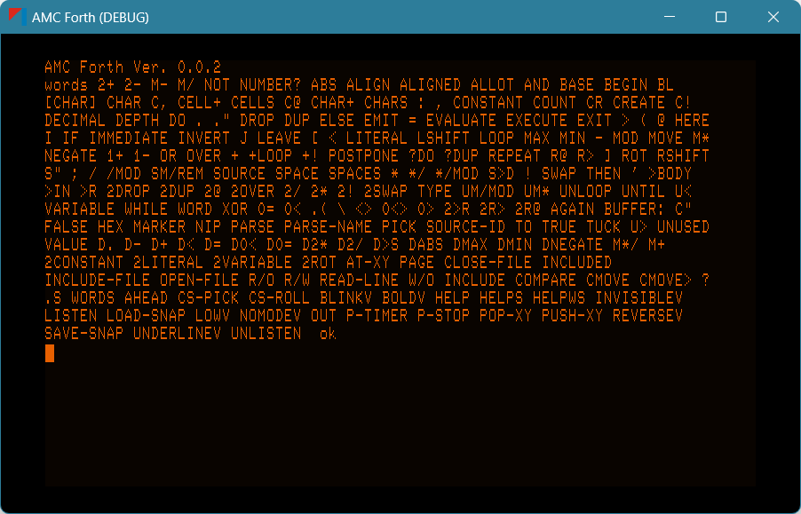

# AMC Forth

This project is for developing an in-game Forth engine that will be used as a flight computer in the AMC SkyDart spacecraft, a craft built by the American Motors Corporation in a fictional 1990. The SkyDart is featured in the upcoming [Tungsten Moon](https://store.steampowered.com/app/3104900/Tungsten_Moon/) game.

## AMCForth C# Implementation for Godot

Please see the [AMCForth language README](./addons/amc_forth/README.md) for details on how to use AMCForth in your Godot project.

## AMCForth Terminals

The project includes a couple of [terminal front-ends](./addons/amc_forth_terminal/README.md) for AMCForth.

## Example Godot Scenes

See the Github project (https://github.com/Eccentric-Anomalies/AMC-Forth) for example Godot 4.3 scenes (2D and 3D) that demonstrate the AMCForth terminal.

## Downloads

See the Github repository [releases page](https://github.com/Eccentric-Anomalies/AMC-Forth/releases) for latest executable binaries.

## License

AMCForth is under the MIT License. Go wild.

## Screenshot

Well.. why not?

